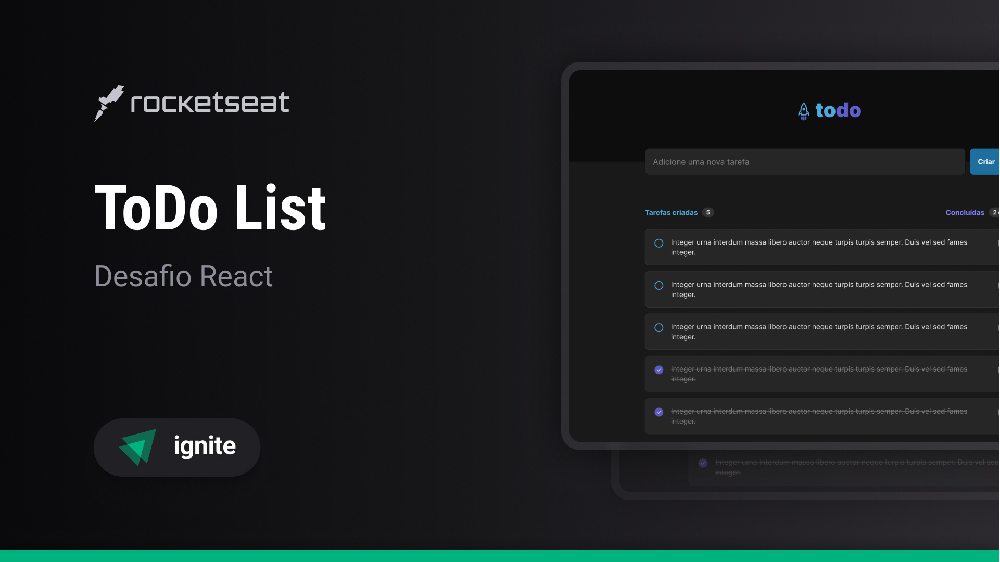
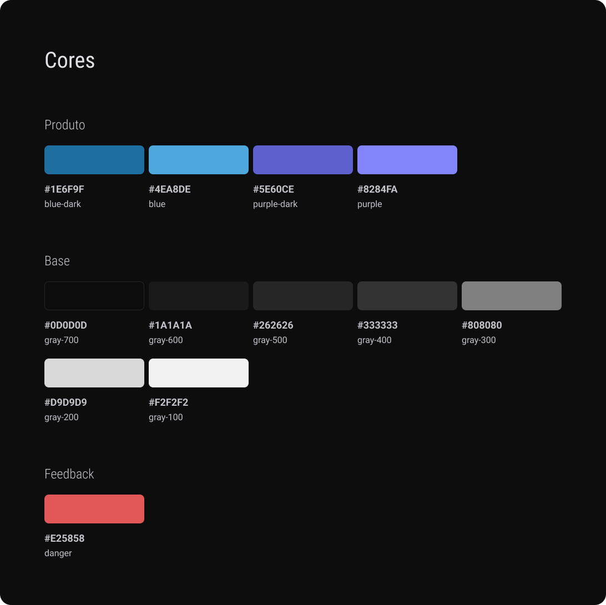
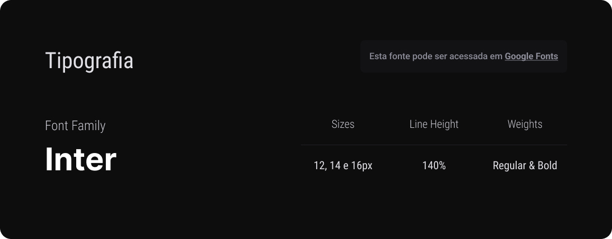
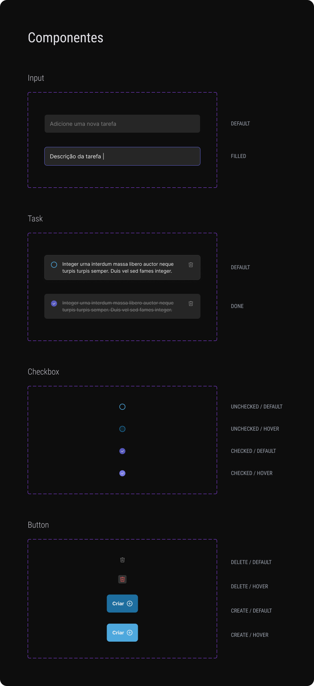
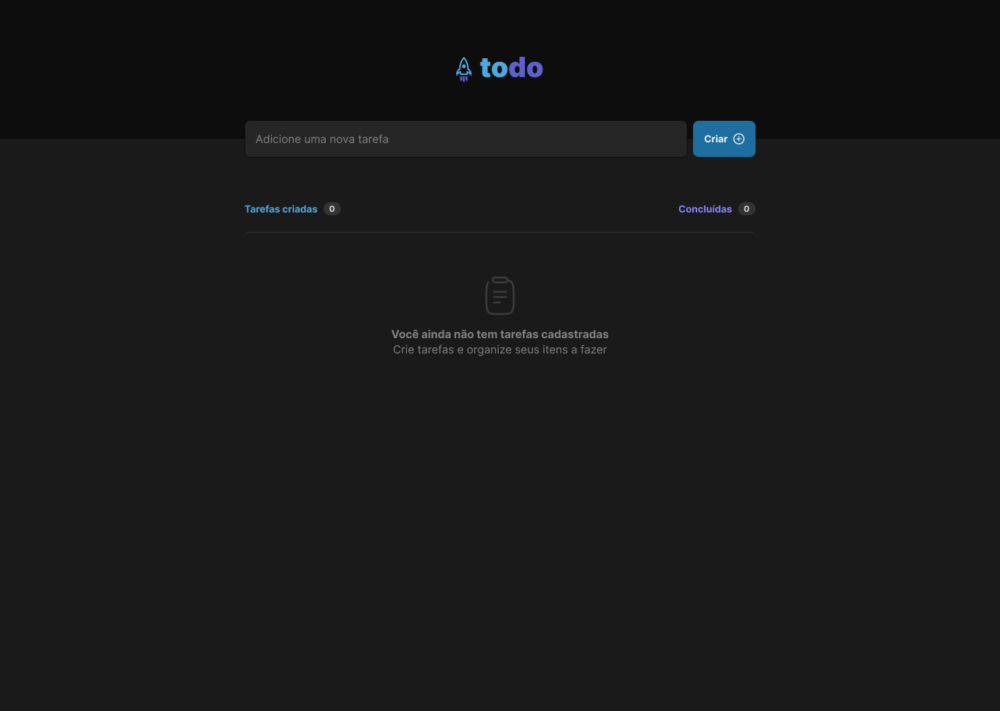
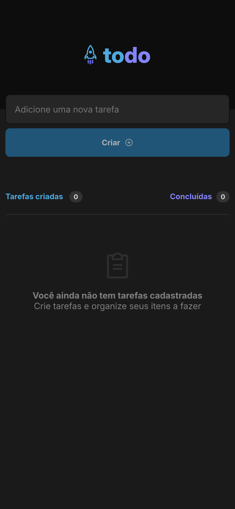
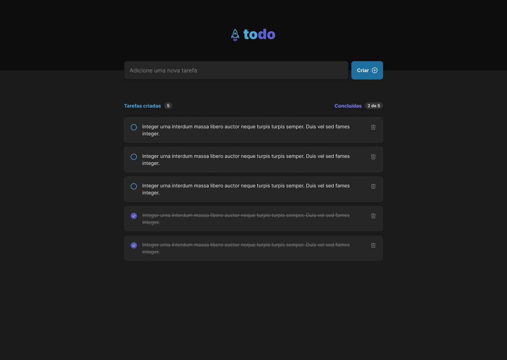
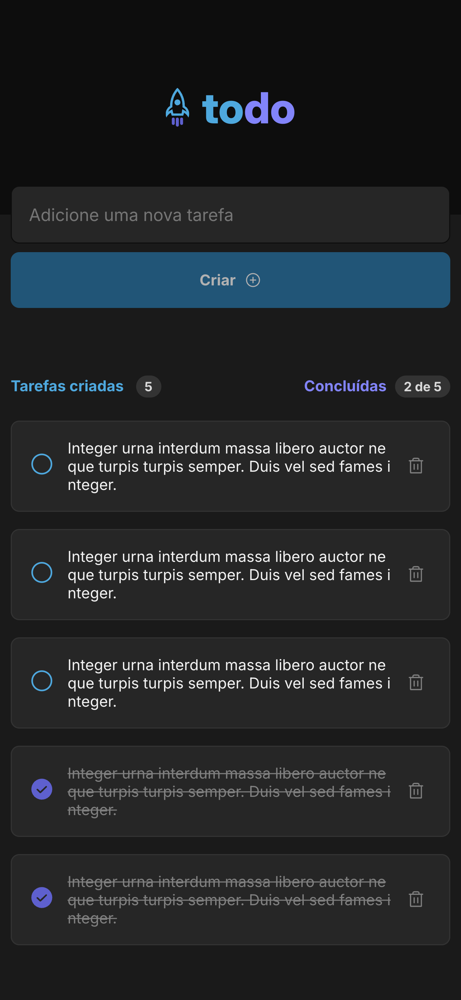

# ToDo List - #1 Desafio Rocketseat One

Projeto realizado no primeiro módulo da formação React na <strong>Rocketseat One</strong>.
O intuito do desafio foi exercitar tudo que foi passado no módulo de Fundamentos Iniciais de React. Fazendo a utilização dos seguintes conteúdos apresentados:

<ul>
  <li><b>Vite:</b> utilizado para criação do projeto, contendo todas as configurações necessárias, utilizando já o Typescript como padrão, tendo live reload imbutido já.</li>
   
  <li><b>Typescript:</b> Uso do TS para construção do projeto facilitou bastante a parte de tipagem, já que dependia de passagem de props pelos componentes, sem tipagem poderiam ser passados parâmetros de qualquer forma, id recebendo string, status recendo números, e assim por diante.</li>
   
  <li><b>React:</b> O conhecimento dado durante o módulo foi o suficiente para que pudesse desenvolver o projeto sem muitas dificuldades, só as citadas mais para frente, que foram adivindas da prática, e não da falta de conteúdo passado durante essa sessão.</li>
   
  <li><b>CSS Module:</b> Utilização de css module facilitou com parte de não deixar poluído os componentes com utilização simples de modularização.</li>
   
  <li><b>Phosphor Icons:</b> Biblioteca de ícones que ajudou no desemvolvimento do projeto, assim não precisando fazer utilização de SVG em assets, simplificando a parte Visual.</li>
   
  <li><b>Use State:</b> Hook básico do React foi utiilizado para atualização dos estados do projeto.</li>
</ul>

## Style Guide

Aqui está o styleguide passado pela equipe da Rocketseat para facilitar o desenvolvimento do projeto, pensando em cada detalhe para deixar a experiência do usuário ainda melhor:

### Cores

### Tipografia

### Components

## Telas

As telas foram desenvolvidas como o projeto demandou, utilizando as cores e tipografias mostradas nas imagens acima, e o layout foi seguido a risca o máximo que pode, alguns ícones talvez tenham ficado diferentes, pois resolvi não usar o svg e sim a biblioteca mencionada a cima, para faacilitar o desenvolvimento da UI.

### ToDO Vazio - Desktop

Nessa tela foi demonstrado como fica sem nenhuma tarefa cadastrada, mostrando o tanto de concluídas e criadas como 0.

### ToDO Vazio - Mobile

A versão responsiva foi criada de forma que conseguisse comportar todo o layout sem precisar mudar muita coisa na tela, mantendo a identidade da versão desktop.

### ToDO Cheia - Desktop

Aqui é mostrado como ficou o layout com tarefas já cadastradas, listando todas na tela. Na listagem já mostra quantas foram criadas e quantas concluidas.
Cada tarefa possue a ação de concluir, apertando o botão redondo ao lado esquerdo dela, e o botão de deletar a tarefa, que está na parte direita da tarefa.

### ToDO Cheia - Mobile

E por último a tela no seu responsivo, como a anterior foi tentado ao máximo manter a identidade que havia na versão desktop, apenas mudando o botão, jogando ele para a linha de baixo e preenchendo a linha toda, decisão tomada para que o usuário tivesse mais facilidade ao clicar, já que demanda de uma tela menor que se estivesse em um computador.

 

## Desafios no Desenvolvimento

O desafio em sí é simples, um projeto básico, onde já produzi vários gerenciadores de tarefas, porém como fiquei longe de programação por bastante tempo, principalmente fora do JS, react, o desenvolvimento demorou um pouco mais até me adaptar com a tecnologia novamente, e praticar mais a lógica.

Como a UI/UX foi nos fornecido pela equipe da Rocketseat essa parte não precisamos desenvolver, facilitando muito o desenvolvimento do projeto, já que a parte da UI toma bastante tempo, não precisando pensar nessa parte, dá tempo para planejar e organizar o código, para fazer tudo funcionar da melhor forma possível.

A principal parte que foi necessário um estudo mais a fundo foi sobre CSS, que foi de extrema ajuda assistir vídeo aulas do Evento de HTML+CSS com o Mayk Brito, para lembrar de conceitos e formas de alinhamentos de itens na tela.

 

## Conclusão

O desafio foi de grande valia para desenvolver melhor as minhas habilidades com react, TS, html, CSS, e parte de lógica básica.
Esse projeto por mais simples e básico que seja, ajuda no desenvolvimento de várias habilidades lógicas para que possa dar prosseguimento em mais complexos.

 

## Equipe:

<b>Desenvolvedor:</b> Marlon Symczecym

<b>UI/UX:</b> Milena Martins (Product Designer @Rocketseat)

<b>Mentor:</b> Diego Fernandes (CTO @Rocketseat)

